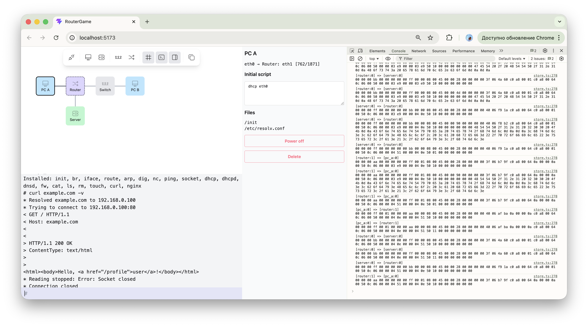

# RouterGame - симулятор сетей

На этом проекте я закрепляю знания по компьютерным сетям, попутно реализуя протоколы и паттерны в виде симулятора.

В качестве прикладной задачи - визуальный конструктор сети. Возможно, это будет некой игровой формой...

Каждое устройство из сети работает через WebWorker, а обмен данными между ними идет через основной поток и отображается в `console.log`.

Порты устройств и драйвера знают о наличии линка (LOWER_UP).

Есть простая файловая система. Она позволяет хранить настройки. Файловая система в реальном времени синхронизируется с основным потоком, поэтому можно управлять файлами запущенного устройства из UI.

Неуправляемое устройство - L2 Switch.

Управляемые устройства с операционной системой.
- FS для хранения состояния между перезапусками
- Ethernet
- Bridge
- VLAN
- ARP
- IP routing
- ICMP ping + некоторые ответы
- UDP
- TCP
- Socket в простом исполнении
- DHCP client + server
- DNS + server
- HTTP клиент-сервер
- Firewall + NAT + masquerade (icmp, udp, tcp)

Все в OS работает на уровне ядра. Доступны некоторые упрощенные аналоги утилит:
- `iface` аналог ifconfig
- `route`
- `br` - создание мостов и управление vlan фильтром
- `arp` - просмотр и запрос mac адресов
- `ping`
- `socket` - просмотр активных сокетов
- `nc` - аналог netcat
- `dig`
- `dnsd` - DNS сервер
- `dhcp` - клиент
- `dhcpd` - сервер
- `fw` - управление firewall
- `curl`
- `nginx` - минимальный, с yaml конфигом
- `cat`, `ls`, `rm`, `touch` - для работы с файлами
